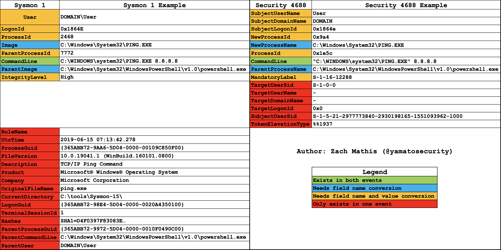
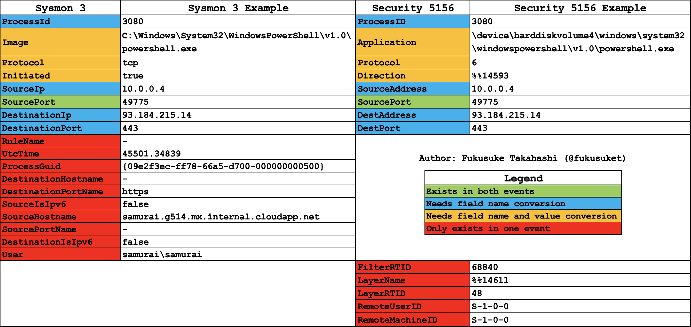

# Windowsイベントログ向けのSigmaルールのキュレーション

[\[English\]](README.md) | [**日本語**]

[](https://www.python.org/)


# 目次

- [Windowsイベントログ向けのSigmaルールのキュレーション](#Windowsイベントログ向けのSigmaルールのキュレーション)
- [目次](#目次)
- [このリポジトリについて](#このリポジトリについて)
- [要約](#要約)
- [Windowsイベントログに関する上流のSigmaルールの課題](#Windowsイベントログに関する上流のSigmaルールの課題)
    - [`logsource`フィールド](#logsourceフィールド)
        - [`service`フィールド](#serviceフィールド)
            - [単一`channel`の例:](#単一channelの例)
            - [複数`channel`の例:](#複数channelの例)
            - [現在の`service`マッピングのリスト](#現在のserviceマッピングのリスト)
            - [Serviceマッピングのソース](#Serviceマッピングのソース)
        - [Categoryフィールド](#Categoryフィールド)
            - [Categoryフィールドの例:](#Categoryフィールドの例)
            - [現在の`category`マッピングのリスト](#現在のcategoryマッピングのリスト)
            - [`Category`フィールドの課題](#Categoryフィールドの課題)
            - [Categoryマッピングソース](#Categoryマッピングソース)
- [ログソース抽象化のメリットと課題](#ログソース抽象化のメリットと課題)
    - [ログソース抽象化のメリット](#ログソース抽象化のメリット)
    - [ログソース抽象化の課題](#ログソース抽象化の課題)
- [変換の例](#変換の例)
    - [変換前](#変換前)
    - [変換後](#変換後)
- [変換の共通点](#変換の共通点)
- [変換の制限](#変換の制限)
- [Sysmonとビルトインイベントの比較およびルール変換](#Sysmonとビルトインイベントの比較およびルール変換)
    - [プロセス作成](#プロセス作成)
        - [比較:](#比較)
        - [変換の注意点:](#変換の注意点)
        - [そのほかの注意点:](#そのほかの注意点)
        - [ビルトインのログ設定](#ビルトインのログ設定)
            - [グループポリシーで有効化](#グループポリシーで有効化)
            - [コマンドラインで有効化](#コマンドラインで有効化)
    - [ネットワークコネクション](#ネットワークコネクション)
        - [比較:](#比較-1)
        - [変換の注意点:](#変換の注意点-1)
        - [ビルトインのログ設定](#ビルトインのログ設定)
            - [グループポリシーで有効化](#グループポリシーで有効化)
            - [コマンドラインで有効化](#コマンドラインで有効化)
- [Sigmaルール作成のアドバイス](#Sigmaルール作成のアドバイス)
- [変換前のSigmaルール](#変換前のSigmaルール)
- [実行環境](#実行環境)
- [ツールの使い方](#ツールの使い方)
- [著者](#著者)


# このリポジトリについて

このリポジトリには、Yamato SecurityがWindowsイベントログ用の上流[Sigma](https://github.com/SigmaHQ/sigma)ルールを、より使いやすい形にカスタマイズする方法についてのドキュメントが含まれています。このプロセスでは、`logsource`フィールドの具体化や、使用できない、または使いづらいと判断されたルールを除外しています。`sigma-to-hayabusa-converter.py`がこれらの処理をします。
このツールは主に、[Hayabusa](https://github.com/Yamato-Security/hayabusa)や[Velociraptor](https://github.com/Velocidex/velociraptor)で使用される、[hayabusa-rules](https://github.com/Yamato-Security/hayabusa-rules)にホスティングされているキュレートされたSigmaルールセットを作成するために使用されています。
この情報が、Windowsイベントログで攻撃を検出するためにSigmaルールを使用しようとしている他のプロジェクトにとっても役立つことを願っています。

# 要約

* `logsource`フィールドを抽象化解除し、組み込みルールや元のSysmonベースのルールのために新しい`.yml`ルールファイルを作成することで、Sigmaルールの完全な組み込みイベントサポートが容易になり、アナリストにとってルールの読みやすさが向上します
* WindowsイベントログのためにSigmaルールを書く際には、元のSysmonベースのログと互換性のある組み込みログの違いを理解し、理想的には両方に対応するようにルールを書くことが重要です
* 多くの組織は、SysmonエージェントをすべてのWindowsエンドポイントにインストールし、維持するための専用リソースがない、またはSysmonによる遅延やクラッシュのリスクを避けたいという理由で、Sysmonエージェントを導入したくない、またはできません。そのため、できるだけ多くの組み込みイベントログを有効にし、それらの組み込みログで攻撃を検出できるツールを使用することが重要です


# Windowsイベントログに関する上流のSigmaルールの課題

私たちの経験では、Windowsイベントログ用のネイティブSigmaルールパーサーを作成する際の主な課題は、`logsource`フィールドのサポートです。
現在、これはHayabusaがまだネイティブでサポートしていない数少ない機能の一つであり、非常に複雑で、現在も進行中の作業です。
当面の間、この問題を回避するために、上流のルールをこのドキュメントで詳しく説明しているように、より使いやすい形式に変換しています。

## `logsource`フィールド

Windowsイベントログ用のSigmaルールでは、productフィールドにwindowsが設定され、その後にserviceフィールドまたはcategoryフィールドが続きます。

`service` フィールドの例:
```
logsource:
    product: windows
    service: application
```

`category` フィールドの例:
```
logsource:
    product: windows
    category: process_creation
```

### `service`フィールド

`service`フィールドは比較的扱いやすく、Sigmaルールを使用するバックエンドに対して、Windows XMLイベントログの`Channel`フィールドに基づいて、単一または複数のChannelを検索するよう指示します。

#### 単一`channel`の例:
`service: application`は、selection条件 `Channel: Application` をSigmaルールに追加するのと同じです。

#### 複数`channel`の例:
`service: applocker`は、複数のチャンネルを最も多く検索する条件を作成します。Applockerは情報を4つの異なるログに保存するためです。Applockerのログのみを適切に検索するためには、Sigmaルールのロジックに次の条件を追加する必要があります:
```
Channel:
    - Microsoft-Windows-AppLocker/MSI and Script
    - Microsoft-Windows-AppLocker/EXE and DLL
    - Microsoft-Windows-AppLocker/Packaged app-Deployment
    - Microsoft-Windows-AppLocker/Packaged app-Execution
``` 

#### 現在のserviceマッピングのリスト

| Service                                 | Channel                                                                                               |
|-----------------------------------------|-------------------------------------------------------------------------------------------------------|
| application                             | Application                                                                                           |
| application-experience                  | Microsoft-Windows-Application-Experience/Program-Telemetry, Microsoft-Windows-Application-Experience/Program-Compatibility-Assistant |
| applocker                               | Microsoft-Windows-AppLocker/MSI and Script, Microsoft-Windows-AppLocker/EXE and DLL, Microsoft-Windows-AppLocker/Packaged app-Deployment, Microsoft-Windows-AppLocker/Packaged app-Execution |
| appmodel-runtime                        | Microsoft-Windows-AppModel-Runtime/Admin                                                              |
| appxpackaging-om                        | Microsoft-Windows-AppxPackaging/Operational                                                           |
| bits-client                             | Microsoft-Windows-Bits-Client/Operational                                                             |
| capi2                                   | Microsoft-Windows-CAPI2/Operational                                                                   |
| certificateservicesclient-lifecycle-system | Microsoft-Windows-CertificateServicesClient-Lifecycle-System/Operational                               |
| codeintegrity-operational               | Microsoft-Windows-CodeIntegrity/Operational                                                           |
| diagnosis-scripted                      | Microsoft-Windows-Diagnosis-Scripted/Operational                                                      |
| dhcp                                    | Microsoft-Windows-DHCP-Server/Operational                                                             |
| dns-client                              | Microsoft-Windows-DNS Client Events/Operational                                                       |
| dns-server                              | DNS Server                                                                                            |
| dns-server-analytic                     | Microsoft-Windows-DNS-Server/Analytical                                                               |
| driver-framework                        | Microsoft-Windows-DriverFrameworks-UserMode/Operational                                               |
| firewall-as                             | Microsoft-Windows-Windows Firewall With Advanced Security/Firewall                                     |
| hyper-v-worker                          | Microsoft-Windows-Hyper-V-Worker                                                                      |
| kernel-event-tracing                    | Microsoft-Windows-Kernel-EventTracing                                                                 |
| kernel-shimengine                       | Microsoft-Windows-Kernel-ShimEngine/Operational, Microsoft-Windows-Kernel-ShimEngine/Diagnostic       |
| ldap_debug                              | Microsoft-Windows-LDAP-Client/Debug                                                                   |
| lsa-server                              | Microsoft-Windows-LSA/Operational                                                                     |
| microsoft-servicebus-client             | Microsoft-ServiceBus-Client                                                                           |
| msexchange-management                   | MSExchange Management                                                                                 |
| ntfs                                    | Microsoft-Windows-Ntfs/Operational                                                                    |
| ntlm                                    | Microsoft-Windows-NTLM/Operational                                                                    |
| openssh                                 | OpenSSH/Operational                                                                                   |
| powershell                              | Microsoft-Windows-PowerShell/Operational, PowerShellCore/Operational                                  |
| powershell-classic                      | Windows PowerShell                                                                                    |
| printservice-admin                      | Microsoft-Windows-PrintService/Admin                                                                  |
| printservice-operational                | Microsoft-Windows-PrintService/Operational                                                            |
| security                                | Security                                                                                              |
| security-mitigations                    | Microsoft-Windows-Security-Mitigations*                                                               |
| shell-core                              | Microsoft-Windows-Shell-Core/Operational                                                              |
| smbclient-connectivity                  | Microsoft-Windows-SmbClient/Connectivity                                                              |
| smbclient-security                      | Microsoft-Windows-SmbClient/Security                                                                  |
| system                                  | System                                                                                                |
| sysmon                                  | Microsoft-Windows-Sysmon/Operational                                                                  |
| taskscheduler                           | Microsoft-Windows-TaskScheduler/Operational                                                           |
| terminalservices-localsessionmanager    | Microsoft-Windows-TerminalServices-LocalSessionManager/Operational                                    |
| vhdmp                                   | Microsoft-Windows-VHDMP/Operational                                                                   |
| wmi                                     | Microsoft-Windows-WMI-Activity/Operational                                                            |
| windefend                               | Microsoft-Windows-Windows Defender/Operational                                                        |


#### Serviceマッピングのソース

私たちは、serviceとchannelをマッピングするためのYAMLファイルを作成し、このリポジトリで定期的にメンテナンスし、ホスティングしています。
これらのファイルは、https://github.com/SigmaHQ/sigma/blob/master/tests/thor.yml からのサービスマッピング情報に基づいています。このファイルは、公式の汎用設定ファイルではないようですが、最も最新の情報を含んでいるようです。

### Categoryフィールド

ほとんどの`category`フィールドは、特定の`Channel`を検索することに加えて、`EventID`フィールドで特定のイベントIDを確認する条件を追加するだけです。
カテゴリ名は主に[Sysmon](https://learn.microsoft.com/en-us/sysinternals/downloads/sysmon) イベントに基づいており、ビルトインのPowerShellログやWindows Defender用の追加カテゴリも含まれています。

#### Categoryフィールドの例:

```
process_creation:
    EventID: 1
    Channel: Microsoft-Windows-Sysmon/Operational
```

#### 現在のCategoryマッピングのリスト

| Category                     | Service             | EventIDs                                        |
|------------------------------|---------------------|-------------------------------------------------|
| antivirus                    | windefend           | 1006, 1007, 1008, 1009, 1010, 1011, 1012, 1017, 1018, 1019, 1115, 1116 |
| clipboard_change             | sysmon              | 24                                              |
| create_remote_thread         | sysmon              | 8                                               |
| create_stream_hash           | sysmon              | 15                                              |
| dns_query                    | sysmon              | 22                                              |
| driver_load                  | sysmon              | 6                                               |
| file_block_executable        | sysmon              | 27                                              |
| file_block_shredding         | sysmon              | 28                                              |
| file_change                  | sysmon              | 2                                               |
| file_creation                | sysmon              | 11                                              |
| file_delete                  | sysmon              | 23, 26                                          |
| file_delete_detected         | sysmon              | 26                                              |
| file_executable_detected     | sysmon              | 29                                              |
| image_load                   | sysmon              | 7                                               |
| **network_connection**       | sysmon              | 3                                               |
| **network_connection**       | security            | 5156                                            |
| pipe_created                 | sysmon              | 17, 18                                          |
| process_access               | sysmon              | 10                                              |
| **process_creation**         | sysmon              | 1                                               |
| **process_creation**         | security            | 4688                                            |
| process_tampering            | sysmon              | 25                                              |
| process_termination          | sysmon              | 5                                               |
| ps_classic_provider_start    | powershell-classic  | 600                                             |
| ps_classic_start             | powershell-classic  | 400                                             |
| ps_module                    | powershell          | 4103                                            |
| ps_script                    | powershell          | 4104                                            |
| raw_access_thread            | sysmon              | 9                                               |
| **registry_add**             | sysmon              | 12                                              |
| **registry_add**             | security            | 4657                                            |
| registry_delete              | sysmon              | 12                                              |
| **registry_event**           | sysmon              | 12, 13, 14                                      |
| **registry_event**           | security            | 4657                                            |
| registry_rename              | sysmon              | 14                                              |
| **registry_set**             | sysmon              | 13                                              |
| **registry_set**             | security            | 4657                                            |
| sysmon_error                 | sysmon              | 255                                             |
| sysmon_status                | sysmon              | 4, 16                                           |
| wmi_event                    | sysmon              | 19, 20, 21                                      |

#### Categoryフィールドの課題

同じ`category`が複数のサービスやイベントIDを使用できることに気づいたかもしれません（**※太字で示しています**）。
これは、ルールで使用されているフィールドがビルトインのイベントログにも存在する場合、`sysmon`用に設計されたSigmaルールを、同様のビルトインWindowsの`Security`イベントログで使用できる可能性があることを意味します。
その場合、フィールド名や場合によっては値を、ビルトインの`security`イベントログのフィールド名と値に合わせて変換する必要があります。
特定のカテゴリにおいては、フィールド名をリネームするだけで済むこともありますが、他のカテゴリではフィールド値のさまざまな変換が必要になるかもしれません。
この変換方法や、`sysmon`ログと`security`ログの互換性については、このドキュメントの後半で詳しく説明しています。

#### Categoryマッピングソース

カテゴリのYAMLマッピングファイルもこのリポジトリでホスティングされており、これらも https://github.com/SigmaHQ/sigma/blob/master/tests/thor.yml の情報に基づいています。

# ログソース抽象化のメリットと課題

ログソースを抽象化し、バックエンドで異なる`Channel`、`EventID`、およびフィールドのマッピングを作成することには、利点と課題があります。

## ログソース抽象化のメリット:

1. Sigmaルールを他のバックエンドクエリに変換する際、`Channel`や`EventID`のフィールド名を適切なバックエンドのフィールド名に変換する方が簡単かもしれません。
2. 2つのルールを1つに統合することが可能です。たとえば、プロセス作成イベントは`Sysmon 1`と`Security 4688`の両方に記録されることがあります。異なるチャンネルやイベントID、フィールドを参照する2つのルールを作成する代わりに、フィールドをSysmonで使用される標準のものに統一し、その後バックエンドコンバータを使用して`Channel`と`EventID`フィールドを追加し、必要に応じて他のフィールド情報を変換できます。これにより、ルールの数が減り、メンテナンスが容易になります。
3. 非常に稀ではありますが、ログソースが別の`Channel`や`EventID`にデータを記録し始めた場合、すべてのSigmaルールを更新する代わりに、マッピングロジックだけを更新すればよいので、メンテナンスが簡単になります。

## ログソース抽象化の課題:

1. 元のSysmonに基づいたSigmaルールが、誤検知を除外するためにビルトインのログには存在しないフィールドを使用している場合、どうすべきでしょうか？検出の可能性を優先してルールを作成するべきでしょうか、それとも誤検知を減らすことを優先して無視するべきでしょうか？理想的には、異なるseverity（深刻度）、status（ステータス）、および誤検知情報を持つ2つのルールを作成し、ユーザーがより適切に対応できるようにする必要があります。
2. ルールをフィルタリングするのが難しくなります。派生ルールがまだ作成されていない場合、`.yml`ファイル内やルールのファイルパスで`Channel`や`EventID`フィールドに基づいてフィルタリングできません。また、ルールIDが同じであるため、ルールIDでフィルタリングすることもできません。
3. アラートがSysmonログから派生したビルトインログのルールから発生した場合、アラートの確認が難しくなります。フィールド名や値が一致しないため、アナリストは多少複雑な変換プロセスを理解し、記憶する必要があります。
4. バックエンドのロジックを作成するのがより複雑になります。

最初の問題については、重要なユースケースがあり、その労力を正当化する場合に新しいルールを作成し維持する以外に対処方法はありませんが、問題2から4に対処するために、`logsource`フィールドの抽象化を解除し、複数のルールを生成できるルールについては2つのルールセットを作成することにしました。ビルトインログで攻撃を検出できるルールは`builtin`ディレクトリに出力され、Sysmon用のルールは`sysmon`ディレクトリに出力されます

# 変換の例

以下は、変換プロセスをより理解するための簡単な例です。

## 変換前
Sigmaルール:
```yaml
logsource:
    category: process_creation
    product: windows
detection:
    selection:
        - Image|endswith: '.exe'
    condition: selection
```

## 変換後
SysmonログのHayabusa互換ルール:
```yaml
logsource:
    category: process_creation
    product: windows
detection:
    process_creation:
        Channel: Microsoft-Windows-Sysmon/Operational
        EventID: 1
    selection:
        - Image|endswith: '.exe'
    condition: process_creation and selection
```

WindowsビルトインログのHayabusa互換ルール:
```yaml
logsource:
    category: process_creation
    product: windows
detection:
    process_creation:
        Channel: Security
        EventID: 4688
    selection:
        - NewProcessName|endswith: '.exe'
    condition: process_creation and selection
```

上記のとおり、`Sysmon 1`ログ用とビルトインの`Security 4688`ログ用の2つのルールが作成されています。
新たに`process_creation`条件がChannelとEventIDと共に追加され、この条件が必須となるようにconditionフィールドに追加されています。
また、元の`Image`フィールド名は`NewProcessName`に変更されています。

# 変換の共通点

特定のカテゴリをどのように変換するかを詳しく説明する前に、すべてのルールに適用される変換の共通部分について説明します。

1. `ignore-uuid-list.txt`にIDが含まれているルールは無視されます。現在、`mimikatz`などのキーワードを含んでいるため、Windows Defenderで誤検知を引き起こすルールのみを無視しています。

2. `Placeholder`ルールは、そのままでは使用できないため無視されます。これらはSigmaリポジトリの[rules-placeholder](https://github.com/SigmaHQ/sigma/tree/master/rules-placeholder/windows/)フォルダに配置されているルールです。

3. 非互換なフィールド修飾子を使用するルール。現在、Hayabusaはここで示されているフィールド修飾子の大部分をサポートしているため、パースエラーを避けるために、これら以外の修飾子を使用するルールは出力されません。

    * all
    * base64
    * base64offset
    * cidr
    * contains
    * endswith
    * endswithfield
    * equalsfield
    * re
    * startswith
    * windash

4. 構文エラーを含むルールは変換されません。

5. Tags in `deprecated` and `unsupported` rules are updated from the V1 format to the V2 format which uses `-` instead of `_` in order keep everything consistant and handle abbreviations in Hayabusa easier. Example: `initial_access` becomes `initial-access`.

6. Since we are adding `Channel` and `EventID` information to rules, we create a new UUIDv4 ID by using the MD5 hash of the original ID and specify the original ID in the `related` field and mark the `type` as `derived`. For rules that can be converted to multiple rules (`sysmon` and `builtin`), we need to create new rule IDs for the derived `builtin` rules as well. In order to do this, we calculate a MD5 hash of the `sysmon` rule ID and use that for the UUIDv4 ID. Here is an example:

   元の Sigmaルール:
    ```
    title: 7Zip Compressing Dump Files
    id: 1ac14d38-3dfc-4635-92c7-e3fd1c5f5bfc
    ```

   作成された`sysmon`ルール:
    ```
    title: 7Zip Compressing Dump Files
    id: ec570e53-4c76-45a9-804d-dc3f355ff7a7
    related:
        - id: 1ac14d38-3dfc-4635-92c7-e3fd1c5f5bfc
        type: derived
    ```

   作成された`builtin`ルール:
    ```
    title: 7Zip Compressing Dump Files
    id: 93586827-5f54-fc91-0b2f-338fd5365694
    related:
        - id: 1ac14d38-3dfc-4635-92c7-e3fd1c5f5bfc
        type: derived
        - id: ec570e53-4c76-45a9-804d-dc3f355ff7a7
        type: derived
    ```

7. ビルトインのWindowsイベントログを検出するルールは`builtin`ディレクトリに出力され、Sysmonログに依存するルールは、上流のSigmaリポジトリ内のディレクトリ構造に対応するサブディレクトリを持つ`sysmon`ディレクトリに出力されます。

# 変換の制限

現在のところ、唯一の[バグ](https://github.com/Yamato-Security/sigma-to-hayabusa-converter/issues/2)は、Sigmaルールのコメント行が、ソースコードに続くコメントでない限り、出力されたルールに含まれないことです。

# Sysmonとビルトインイベントの比較およびルール変換

## プロセス作成

* Category: `process_creation`
* Sysmon
    * Channel: `Microsoft-Windows-Sysmon/Operational`
    * Event ID: `1`
* Built-in log
    * Channel: `Security`
    * Event ID: `4688`

### 比較:



### 変換の注意点:

1. `User` フィールドの情報は `SubjectUserName` と `SubjectDomainName` に分割される。
2. `LogonId` フィールド名は `SubjectLogonId` に変換され、16進数の値はlowercaseに変換される。
3. `ProcessId` フィールド名は `NewProcessId`  に変換され、値は16進数の値に変換される。
4. `Image` フィールド名は `NewProcessName` に変換される。
5. `ParentProcessId` フィールド名は `ProcessId` に変換され、値は16進数の値に変換される。
6. `ParentImage` フィールド名は `ParentProcessName` に変換される。
7. `IntegrityLevel` フィールド名は `MandatoryLabel` に変換され、以下の変換が必要:
    * `Low`: `S-1-16-4096`
    * `Medium`: `S-1-16-8192`
    * `High`: `S-1-16-12288`
    * `System`: `S-1-16-16384`
8. ルールに`Security 4688`イベントにのみ存在する以下のフィールドが含まれている場合、`Sysmon 1`ルールは作成しません:
    * `SubjectUserSid`, `TokenElevationType`, `TargetUserSid`, `TargetUserName`, `TargetDomainName`, `TargetLogonId`
9. ルールに`Sysmon 1`イベントにのみ存在する以下のフィールドが含まれている場合、`Security 4688`ルールは作成しません:
    * `RuleName`, `UtcTime`, `ProcessGuid`, `FileVersion`, `Description`, `Product`, `Company`, `OriginalFileName`, `CurrentDirectory`, `LogonGuid`, `TerminalSessionId`, `Hashes`, `ParentProcessGuid`, `ParentCommandLine`, `ParentUser`
10. 例外として、#8および#9に該当する場合でも、特定のフィールドが`OR`条件内で使用されている場合、そのルールは依然として作成する必要があります。たとえば、以下のルールは`OriginalFileName`フィールドが必須であるため、`Security 4688`ルールを生成しません
    ```
    selection_img:
        Image|endswith: \addinutil.exe
        OriginalFileName: AddInUtil.exe
    ```  
    しかし、以下の条件を持つルールは、`OriginalFileName`がオプションであるため、`Security 4688`ルールを作成する必要があります。
    ```
    selection_img:
        - Image|endswith: \addinutil.exe
        - OriginalFileName: AddInUtil.exe
    ```
    問題なのは、パーサーがselectionの中だけでなく、conditionフィールド内のロジックも理解する必要がある点です。たとえば、以下のルールは`AND`ロジックを使用しているため、`Security 4688`ルールを作成すべきではありません。
    ```
    selection_img:
        Image|endswith: \addinutil.exe
    selection_orig:
        OriginalFileName: AddInUtil.exe
    condition: selection_img and selection_orig
    ```    
    しかし、以下のルールは`OR`ロジックを使用しているため、`Security 4688`ルールを作成すべきです。
    ```
    selection_img:
        Image|endswith: \addinutil.exe
    selection_orig:
        OriginalFileName: AddInUtil.exe
    condition: selection_img or selection_orig
    ```     

### そのほかの注意点:

* `Security 4688`の`SubjectUserSid`フィールドにはSIDが表示されますが、レンダリングされたイベントログの`Message`内ではDOMAIN\Userに変換されます。
* `Security 4688`イベントでは、設定によってはCommandLineにコマンドラインオプションの情報が含まれない場合があります。
* `TokenElevationType`は`Message`内でそのまま表示され、変換されません。
* `MandatoryLabe`l内の`S-1-16-4096`などは、レンダリングされた`Message`内で`Mandatory Label\Low Mandatory` Levelなどに変換されます。

### ビルトインのログ設定

残念ながら、最も重要な組み込みの`Security 4688`プロセス作成イベントログはデフォルトでは有効になっていません。
Sigmaルールの大部分を使用するには、`4688`イベントを有効にし、コマンドラインオプションのログ記録もオンにする必要があります

#### グループポリシーで有効化

* `Computer Configuration > Policies > Windows Settings > Security Settings > Advanced Audit Configuration > Detailed Tracking > Audit Process Creation`: `Enabled`
* `Administrative Templates > System > Audit Process Creation > Include command line in process creation events`: `Enabled`

#### コマンドラインで有効化

```
auditpol /set /subcategory:{0CCE922B-69AE-11D9-BED3-505054503030} /success:enable /failure:enable
reg add HKLM\SOFTWARE\Microsoft\Windows\CurrentVersion\Policies\System\Audit /v ProcessCreationIncludeCmdLine_Enabled /f /t REG_DWORD /d 1
```

## ネットワークコネクション

* Category: `network_connection`
* Sysmon
    * Channel: `Microsoft-Windows-Sysmon/Operational`
    * Event ID: `3`
* Built-in log
    * Channel: `Security`
    * Event ID: `5156`

### 比較:



### 変換の注意点:

1. `ProcessId` フィールドは `ProcessID` に変換される。
2. `Image` フィールドは `Application` and `C:\` changes to `\device\harddiskvolume?\`. (Note: since we do not know the hard disk volume number, we replace it with a single character wildcard `?`.)
3. `Protocol` フィールドの `tcp` は `6` に、 `udp` は `17' に変換される。
4. `Initiated` フィールドの `Direction` の値 `true` は `%%14593` に、 `false` は　`%%14592` に変換される。
5. `SourceIp` フィールドは `SourceAddress` に変換される。
6. `DestinationIp` フィールドは `DestAddress` に変換される。
7. `DestinationPort` フィールドは `DestPort` に変換される。

### ビルトインのログ設定

Built-in `Security 5156` network connection logs are not enabled by default.
This will create a large amount of logs which may overwrite other important logs in the `Security` event and potentially cause the system to slow down if it has a high amount of network connections so make sure that the maximum file size for the `Security` log is high and that you test to make sure there are no adverse effects to the system.

#### グループポリシーで有効化

* `Computer Configuration -> Windows Settings -> Security Settings -> Advanced Audit Policy Configuration -> System Audit Policies -> Object Access -> Filtering Platform Connection`:  `Success and Failture`

#### コマンドラインで有効化

```
auditpol /set /subcategory:"Filtering Platform Connection" /success:enable /failure:enable
```

英語以外のロケールを使用している場合は、以下のようになります：

```
auditpol /set /subcategory:{0CCE922F-69AE-11D9-BED3-505054503030} /success:enable /failure:enable
```

# Sigmaルール作成のアドバイス

もし、`sysmon` ログには存在するが、`builtin` ログには存在しないフィールドを使用する場合は、`builtin` ログにルールを使用できるように、そのフィールドをオプションにしてください。例えば:
  ```
  selection_img:
      - Image|endswith: \addinutil.exe
      - OriginalFileName: AddInUtil.exe
  ```
  このselectionは、プロセス（`Image`）の名前が `addinutil.exe` であることを検出する。問題は、攻撃者がこのルールを回避するためにファイル名を変更することである。Sysmonのログにのみ存在する `OriginalFileName` フィールドは、コンパイル時にバイナリに埋め込まれるファイル名である。攻撃者がファイル名を変更しても、埋め込まれたファイル名は変更されないので、このルールはSysmonを使用する際に攻撃者がファイル名を変更した攻撃を検出することができます

# 変換前のSigmaルール

Sigmaルールは、本ドキュメントで説明されている方法で`logsource`フィールドの抽象化を解除してキュレーションされ、[hayabusa-rules](https://github.com/Yamato-Security/hayabusa-rules)リポジトリの`sigma`フォルダにホスティングされています。

# 実行環境
SigmaルールをローカルでHayabusa互換形式に変換したい場合、まず[Poetry](https://python-poetry.org/)をインストールする必要があります。
Poetryのインストールについては、以下のリンクから公式ドキュメントを参照してください。
https://python-poetry.org/docs/#installation

# ツールの使い方

`sigma-to-hayabusa-converter.py`は、Sigmaルールの`logsource`フィールドをHayabus互換形式に変換するための主要なツールです。
これを実行するには、以下の手順を実行してください。


1. `git clone https://github.com/SigmaHQ/sigma.git`
2. `git clone https://github.com/Yamato-Security/sigma-to-hayabusa-converter.git`
3. `cd sigma-to-hayabusa-converter`
4. `poetry install --no-root`
5. `poetry run python sigma-to-hayabusa-converter.py -r ../sigma -o ./converted_sigma_rules`

上記実行後、`./converted_sigma_rules`にHayabusa形式に変換されたルールが出力されます。

# 著者

このドキュメントは、Zach Mathis (@yamatosecurity)によって作成され、Fukusuke Takahashi (@fukusuket)によって日本語に翻訳されました。

`sigma-to-hayabusa-converter.py`ツールの実装とメンテナンスはFukusuke Takahashiが担当しています。

現在deprecatedとなったsigmacツールベースの元の変換ツールは、ItiB ([@itiB_S144](https://x.com/itib_s144))とJames Takai / hachiyone (@hach1yon)によって実装されました。